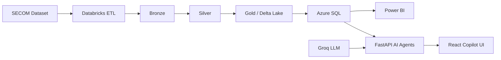

# Semiconductor Intelligence Hub

**Azure Data Copilot** — an enterprise AI analytics platform that turns natural-language questions into trusted insights over Azure SQL, backed by a Databricks medallion pipeline, Power BI dashboards, and a multi-agent Copilot.

[](https://www.python.org/)
[](https://react.dev/)
[](https://fastapi.tiangolo.com/)
[](LICENSE)

| | |
|---|---|
| **Demo** | [https://semiconductor-ai-sanjana.azurewebsites.net](https://semiconductor-ai-sanjana.azurewebsites.net) |
| **Repository** | [github.com/sanjanashetti13/semiconductor-data-plateform](https://github.com/sanjanashetti13/semiconductor-data-plateform) |

---

## Architecture

### End-to-end data & AI pipeline

```text
SECOM Dataset
      │
      ▼
Azure Databricks ETL (PySpark)
      │
      ├── Bronze  (raw ingest)
      ├── Silver  (cleaned / typed)
      └── Gold    (analytics-ready)
      │
      ▼
Delta Lake (curated lakehouse tables)
      │
      ▼
Azure SQL Database
  • fact_sensor_readings
  • dim_time
  • vw_manufacturing_summary
      │
      ├──► Power BI  (executive dashboards — external URL)
      │
      └──► FastAPI AI Copilot
                │
                ├── Planner Agent
                ├── Database / Schema Agents  (safe SELECT only)
                ├── Knowledge / Analytics / Recommendation Agents
                ├── Power BI Agent
                └── ML Agent (Random Forest failure model)
                │
                ▼
         React Workspace UI
```

### Application runtime (one Azure App Service URL)

```text
Browser  →  https://<app>.azurewebsites.net
               ├── /api/*     FastAPI (Groq LLM, Azure SQL via ODBC)
               └── /*         React production build (frontend/dist)
```



---

## Screenshots

Add PNGs under [`docs/screenshots/`](docs/screenshots/) (never include passwords or live secrets). Once present, they render below:

| File | Description |
|------|-------------|
| `docs/screenshots/copilot.png` | AI Copilot chat |
| `docs/screenshots/database-connection.png` | Azure SQL connection |
| `docs/screenshots/power-bi.png` | Power BI dashboard page |
| `docs/screenshots/architecture.png` | Architecture overview |

```markdown


```

See [`docs/screenshots/README.md`](docs/screenshots/README.md) for naming guidance.

---

## Features

- **AI Copilot** — natural-language Q&A over the connected Azure SQL database  
- **Multi-agent orchestration** — Planner → Database / Schema / Knowledge / Analytics / Recommendation / Power BI / ML  
- **Semiconductor Mode** — auto-enabled when curated objects (`fact_sensor_readings`, `dim_time`, `vw_manufacturing_summary`) are present  
- **Generic SQL Mode** — connect any Azure SQL database from the UI  
- **Safe SQL** — SELECT-only validation; no DDL/DML  
- **See SQL Query** — contextual expand/copy for successfully executed SQL (hidden by default)  
- **Visualizations** — optional bar/line charts from real query results  
- **Schema intelligence** — INFORMATION_SCHEMA profiling, fact/dim/view roles, relationships  
- **Power BI integration** — open/embed a published report URL (browser-local; not recreated in-app)  
- **ML agent** — Random Forest wafer-failure model integration when asked  
- **Developer Mode** — optional planner/agent/SQL/timing details (off by default)  
- **One-host production deploy** — FastAPI serves `frontend/dist` on Azure App Service  

---

## Tech stack

| Layer | Technologies |
|--------|----------------|
| Frontend | React 19, TypeScript, Vite, Tailwind CSS, React Router |
| Backend | FastAPI, Uvicorn, Pydantic, Python 3.11 |
| AI / LLM | Groq (`llama-3.3-70b-versatile`), custom multi-agent layer |
| Data warehouse | Azure SQL Database, ODBC Driver 18, `pyodbc` |
| Lakehouse / ETL | Azure Databricks, PySpark, medallion Bronze → Silver → Gold, Delta Lake |
| BI | Microsoft Power BI (external report / embed URL) |
| ML | scikit-learn Random Forest (optional artifact under `ml_outputs/`) |
| CI/CD | GitHub Actions + Azure App Service (OIDC federated credentials) |
| Hosting | Azure App Service (Linux, Python 3.11) |

---

## Dataset / source attribution

This project uses the **SECOM** (Semiconductor Manufacturing) dataset from the [UCI Machine Learning Repository](https://archive.ics.uci.edu/dataset/179/secom):

- High-dimensional process sensor readings from a semiconductor manufacturing line  
- Pass/fail labels used for yield and quality analytics  
- Curated gold data is loaded into Azure SQL (e.g. `fact_sensor_readings`) for Copilot and Power BI  

Please cite UCI SECOM when publishing results that rely on this data.

---

## Setup instructions

### Prerequisites

- Python **3.11+**
- Node.js **20+**
- [ODBC Driver 18 for SQL Server](https://learn.microsoft.com/sql/connect/odbc/download-odbc-driver-for-sql-server)
- Groq API key
- Azure SQL database (for live Copilot queries)

### 1. Clone

```bash
git clone https://github.com/sanjanashetti13/semiconductor-data-plateform.git
cd semiconductor-data-plateform
```

### 2. Backend

```bash
python -m venv .venv

# Windows
.\.venv\Scripts\activate

# macOS / Linux
source .venv/bin/activate

pip install -r requirements.txt
cp .env.example .env
# Edit .env — set at least GROQ_API_KEY (and SQL_* for Semiconductor Mode)

python -m uvicorn backend.main:app --reload --host 127.0.0.1 --port 8000
```

Optional local ETL dependencies: `pip install -r requirements-etl.txt`

### 3. Frontend (dev)

```bash
cd frontend
cp .env.example .env
npm ci
npm run dev
```

Open [http://127.0.0.1:5173/copilot](http://127.0.0.1:5173/copilot)

1. **Database Connection** → enter Azure SQL Server, Database, Username, Password → Connect  
2. **AI Copilot** → ask manufacturing or schema questions  
3. **Power BI** → configure a published report URL (stored in this browser only)  

### 4. One-process production smoke test (local)

```bash
cd frontend && npm ci && npm run build && cd ..

# Windows PowerShell
$env:APP_ENV="production"
python -m uvicorn backend.main:app --host 0.0.0.0 --port 8000
```

- UI: `http://127.0.0.1:8000/`  
- Health: `http://127.0.0.1:8000/api/health`  

---

## Environment variables

Copy [`.env.example`](.env.example) → `.env`. **Never commit `.env`.**

### Backend (App Service Application Settings in production)

| Variable | Required | Purpose |
|----------|----------|---------|
| `APP_ENV` | Production | Use `production` on Azure |
| `GROQ_API_KEY` | **Yes** | Groq LLM (backend only) |
| `GROQ_MODEL` | No | Default `llama-3.3-70b-versatile` |
| `SQL_SERVER` | Semiconductor Mode | Azure SQL host |
| `SQL_DATABASE` | Semiconductor Mode | Database name |
| `SQL_USERNAME` | Semiconductor Mode | SQL login |
| `SQL_PASSWORD` | Semiconductor Mode | SQL password |
| `SQL_DRIVER` | No | Default `ODBC Driver 18 for SQL Server` |
| `CORS_ORIGINS` | No | Dev localhost list; **leave empty** for same-origin App Service |
| `ENABLE_DIAGNOSTICS` | No | `true` enables `/api/diagnostics/odbc` (keep off in public prod) |
| `ENABLE_API_DOCS` | No | Keep `/docs` in production when `true` |
| `POWERBI_URL` | No | Ops hint only — users configure URL in the UI |

Aliases `AZURE_SQL_*` are accepted with the same meaning as `SQL_*`.

### Frontend build-time (optional)

| Variable | Required | Purpose |
|----------|----------|---------|
| `VITE_API_BASE_URL` | No | Leave **empty** so the browser calls same-origin `/api/...` |
| `VITE_POWERBI_URL` | No | Optional public default report URL (**no secrets**) |

### Security rules for env

- Never set `VITE_GROQ_API_KEY`, `VITE_SQL_PASSWORD`, or any secret in `VITE_*`  
- Generic Mode passwords stay in **server memory** for the session only (not written to disk)  
- Production responses must not include stack traces, connection strings, or raw ODBC errors  

---

## Deployment information

### Recommended: Azure App Service (Linux, Python 3.11)

| Setting | Value |
|---------|--------|
| App name (example) | `semiconductor-ai-sanjana` |
| OS | Linux |
| Runtime | Python 3.11 |
| Startup command | `bash startup.sh` |
| Equivalent | `python -m uvicorn backend.main:app --host 0.0.0.0 --port $PORT` |

**Application settings (portal):**

```text
APP_ENV=production
GROQ_API_KEY=<secret>
SQL_SERVER=<secret>
SQL_DATABASE=<secret>
SQL_USERNAME=<secret>
SQL_PASSWORD=<secret>
```

FastAPI serves the React build from `frontend/dist` with SPA fallback for `/copilot`, `/data-sources`, `/power-bi`, `/architecture`.

**ODBC:** Azure SQL needs **ODBC Driver 18** on the App Service host. If the driver is missing, the API still starts; SQL routes return a safe **503**.

### Demo

- Live app: [https://semiconductor-ai-sanjana.azurewebsites.net](https://semiconductor-ai-sanjana.azurewebsites.net)  
- Health check: `/api/health`  

> Update the demo URL if your App Service name differs.

---

## CI/CD explanation

GitHub Actions workflow: [`.github/workflows/azure-app-service.yml`](.github/workflows/azure-app-service.yml)

```text
push to main  /  workflow_dispatch
        │
        ▼
   BUILD job
   • Checkout
   • Python 3.11 + Node 20
   • frontend: npm ci && npm run build
   • Verify frontend/dist/index.html
   • Package: backend/, ai/, frontend/dist/, requirements.txt, startup.sh, runtime.txt
   • Upload artifact
        │
        ▼
   DEPLOY job
   • azure/login@v2  (OIDC — no passwords in the workflow)
   • azure/webapps-deploy@v3 → App Service (slot: Production)
```

**GitHub secrets (OIDC):**

- `AZURE_CLIENT_ID`  
- `AZURE_TENANT_ID`  
- `AZURE_SUBSCRIPTION_ID`  

**Important:** The Azure Entra **federated credential Subject** must match GitHub’s OIDC `sub` exactly (often the immutable form):

```text
repo:sanjanashetti13@192409648/semiconductor-data-plateform@1311673727:ref:refs/heads/main
```

Issuer: `https://token.actions.githubusercontent.com`  
Audience: `api://AzureADTokenExchange`

Python packages are installed on App Service via Oryx (`requirements.txt`); the workflow does not ship a huge `antenv` from CI.

---

## Security notes

- No hardcoded Groq keys or SQL passwords in source  
- `.env` / `.env.*` gitignored (`!.env.example` kept)  
- SELECT-only SQL validation (rejects DROP/DELETE/UPDATE/INSERT/ALTER/CREATE/TRUNCATE/EXEC/MERGE)  
- Friendly user-facing errors; details logged server-side only  
- Session credentials cleared on Disconnect  
- Developer Mode off by default  
- Power BI URLs stored in **browser localStorage** only  
- Same-origin production API calls (`/api/...`) — no secrets in the JS bundle  

If a password was ever committed historically, **rotate it in Azure** immediately.

---

## Folder structure

```text
backend/              FastAPI app + routers
ai/                   Multi-agent Copilot, SQL agent, tools, LLM
ai/agents/            Planner + specialized agents
ai/sql_agent/         Planner, profiler, KPI, semantics, validator
frontend/             React workspace (Vite)
scripts/              Ops / load / OIDC helper scripts
docs/                 Extra docs + screenshots
tests/                Pytest suites
data/                 Sample / gold data (large files gitignored)
.env.example          Env template
startup.sh            Azure App Service startup
.github/workflows/    Azure App Service CI/CD
```

---

## Demo link

**Live demo:** [https://semiconductor-ai-sanjana.azurewebsites.net](https://semiconductor-ai-sanjana.azurewebsites.net)

Useful paths after deploy:

| Path | Purpose |
|------|---------|
| `/` | App (redirects to Copilot) |
| `/copilot` | AI Copilot |
| `/data-sources` | Azure SQL connection |
| `/power-bi` | Power BI dashboard |
| `/architecture` | Architecture page |
| `/api/health` | Health probe |

---

## GitHub repository

**https://github.com/sanjanashetti13/semiconductor-data-plateform**

---

## License

This project is licensed under the **MIT License** — see [`LICENSE`](LICENSE).
