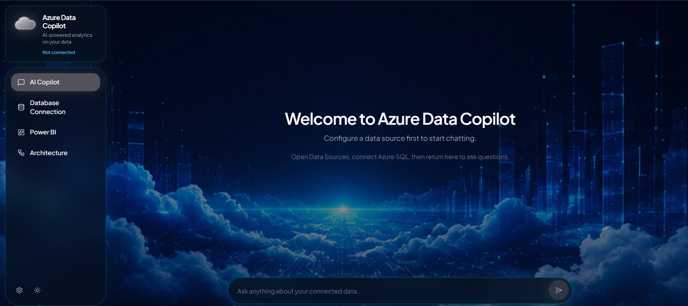
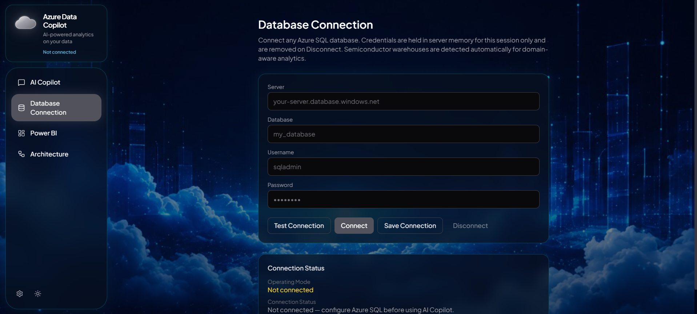
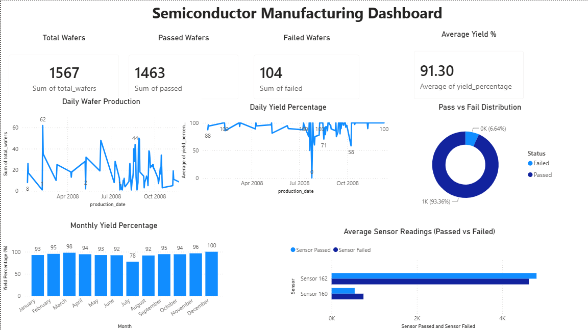

# Semiconductor Intelligence Hub

**Azure Data Copilot** — ask natural-language questions over Azure SQL and get trusted manufacturing insights, powered by Groq and a multi-agent AI stack.

<p align="center">
  <a href="https://semiconductor-ai-sanjana.azurewebsites.net"><strong>Live Demo</strong></a>
  ·
  <a href="https://github.com/sanjanashetti13/semiconductor-data-plateform">GitHub</a>
  ·
  <a href="LICENSE">MIT License</a>
</p>

<p align="center">
  
  
  
  
</p>

---

## Demo

<p align="center">
  
</p>

<p align="center">
  
  &nbsp;
  
</p>

---

## Architecture

```text
SECOM → Databricks ETL → Bronze → Silver → Gold → Delta Lake
                                                      ↓
                                               Azure SQL
                                          ↙               ↘
                                   Power BI          AI Copilot
                                                   (FastAPI + Groq)
                                                        ↓
                                                   React UI
```

---

## Features

- Natural-language analytics over any connected Azure SQL database  
- Multi-agent Copilot (Planner, Database, Schema, Knowledge, Analytics, ML, Power BI)  
- Semiconductor Mode for curated yield / sensor warehouses  
- Safe SELECT-only SQL with optional **See SQL Query**  
- Charts from real query results  
- Power BI report open / embed (browser-local URL)  
- One-URL deploy on Azure App Service  

---

## Tech stack

React · TypeScript · Vite · FastAPI · Groq · Azure SQL · Databricks · Delta Lake · Power BI · GitHub Actions  

**Data:** [SECOM](https://archive.ics.uci.edu/dataset/179/secom) (UCI) — semiconductor process sensors & pass/fail labels.

---

## Quick start

```bash
git clone https://github.com/sanjanashetti13/semiconductor-data-plateform.git
cd semiconductor-data-plateform

python -m venv .venv
# Windows: .\.venv\Scripts\activate
source .venv/bin/activate
pip install -r requirements.txt
cp .env.example .env          # set GROQ_API_KEY (+ SQL_* for Mode 1)

python -m uvicorn backend.main:app --reload --port 8000

cd frontend && npm ci && npm run dev
```

Open [http://127.0.0.1:5173/copilot](http://127.0.0.1:5173/copilot) → connect Azure SQL → ask questions.

---

## Environment

| Variable | Purpose |
|----------|---------|
| `GROQ_API_KEY` | LLM (required, backend only) |
| `SQL_SERVER` / `SQL_DATABASE` / `SQL_USERNAME` / `SQL_PASSWORD` | Semiconductor warehouse (optional if using UI connect) |
| `APP_ENV` | `production` on Azure |
| `VITE_API_BASE_URL` | Leave empty for same-origin `/api` |

Never put secrets in `VITE_*`. Full template: [`.env.example`](.env.example).

---

## Deploy & CI/CD

**Azure App Service** (Linux · Python 3.11) · Startup: `bash startup.sh`

GitHub Actions builds the React app and deploys via **OIDC** (`AZURE_CLIENT_ID` / `TENANT_ID` / `SUBSCRIPTION_ID`) — no passwords in the workflow.

**Demo:** [semiconductor-ai-sanjana.azurewebsites.net](https://semiconductor-ai-sanjana.azurewebsites.net)

---

## Security

SELECT-only SQL · secrets stay server-side · session credentials cleared on disconnect · no stack traces to users · Developer Mode off by default.

---

## License

[MIT](LICENSE)
