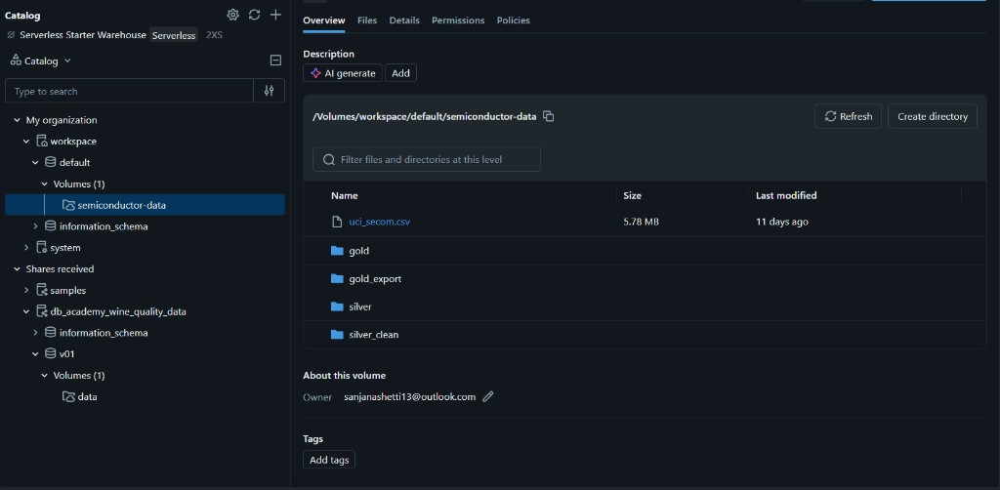

# Semiconductor Intelligence Hub

**Azure Data Copilot** — an end-to-end **data engineering + AI** platform for semiconductor manufacturing analytics: lakehouse ETL on Databricks, curated Azure SQL, Power BI, and a multi-agent Copilot over live warehouse data.

<p align="center">
  <a href="https://semiconductor-ai-sanjana.azurewebsites.net"><strong>Live Demo</strong></a>
  ·
  <a href="https://github.com/sanjanashetti13/semiconductor-data-plateform">GitHub</a>
  ·
  <a href="LICENSE">MIT License</a>
</p>

<p align="center">
  
  
  
  
</p>

---

## Demo

<p align="center">
  
</p>

<p align="center">
  
  &nbsp;
  
</p>

---

## Architecture

```text
SECOM Dataset
      ↓
Azure Databricks ETL (PySpark)
      ↓
Bronze → Silver → Gold  (Delta Lake / Volumes)
      ↓
Azure SQL  (facts · dimensions · KPI views)
      ↙                         ↘
Power BI                   AI Copilot (FastAPI + Groq)
(executive dashboards)     Multi-agent: Planner → SQL / Schema /
                           Knowledge / Analytics / ML / Power BI
                                      ↓
                               React Workspace
```

<p align="center">
  
  <br />
  <em>Databricks Catalog — SECOM volume with Silver / Gold medallion layers</em>
</p>

---

## Data engineering

What this project implements on the **data platform** side:

| Stage | What we did |
|--------|-------------|
| **Ingest** | Loaded the UCI [SECOM](https://archive.ics.uci.edu/dataset/179/secom) semiconductor sensor dataset into Databricks Volumes |
| **Medallion ETL** | Built a **Bronze → Silver → Gold** pipeline on Azure Databricks (raw → cleaned → analytics-ready) |
| **Lakehouse** | Stored curated layers as Delta / volume folders (`silver`, `silver_clean`, `gold`, `gold_export`) |
| **Serving** | Published Gold metrics into **Azure SQL** (`fact_sensor_readings`, `dim_time`, `vw_manufacturing_summary`) |
| **BI** | Connected **Power BI** to Azure SQL for executive yield / quality dashboards |
| **Ops** | Scripts to profile, transform, and load gold data to SQL (`etl/`, `scripts/load_gold_to_sql.py`) |

**Outcome:** a production-style path from raw manufacturing sensors to a governed SQL warehouse that both Power BI and the AI Copilot can trust.

---

## Artificial intelligence

What this project implements on the **AI** side:

| Capability | What we did |
|------------|-------------|
| **Multi-agent Copilot** | Planner orchestrates specialized agents instead of one monolithic prompt |
| **Database Agent** | Generates & runs **safe SELECT-only** SQL against the connected Azure SQL schema |
| **Schema Agent** | Profiles tables/views, roles (fact / dim / KPI view), keys, and relationships |
| **Knowledge Agent** | Answers domain questions (SECOM, wafers, ETL, Azure, Power BI) without inventing metrics |
| **Analytics & Recommendations** | Interprets query results and suggests process improvements |
| **ML Agent** | Integrates a **Random Forest** wafer-failure model (feature importance / prediction Q&A) |
| **Power BI Agent** | Helps validate and explain dashboard integration |
| **UX** | Concise answers, optional charts from real rows, **See SQL Query** when SQL actually ran |

**Outcome:** users connect a database, ask in plain English (“lowest yield month?”, “avg of sensor_000–007?”), and get grounded answers — not hallucinated numbers.

---

## Tech stack

| Area | Tools |
|------|--------|
| Lakehouse / ETL | Azure Databricks, PySpark, Delta Lake, medallion architecture |
| Warehouse / BI | Azure SQL, ODBC Driver 18, Power BI |
| AI | Groq LLM, custom agent orchestration, scikit-learn RF |
| App | FastAPI, React, TypeScript, Vite, Tailwind |
| DevOps | GitHub Actions → Azure App Service (OIDC) |

---

## Quick start

```bash
git clone https://github.com/sanjanashetti13/semiconductor-data-plateform.git
cd semiconductor-data-plateform

python -m venv .venv && source .venv/bin/activate   # Windows: .\.venv\Scripts\activate
pip install -r requirements.txt
cp .env.example .env                                # set GROQ_API_KEY (+ SQL_* if needed)

python -m uvicorn backend.main:app --reload --port 8000
cd frontend && npm ci && npm run dev
```

Open [http://127.0.0.1:5173/copilot](http://127.0.0.1:5173/copilot) → **Database Connection** → ask questions.

---

## Environment

| Variable | Purpose |
|----------|---------|
| `GROQ_API_KEY` | LLM (required, backend only) |
| `SQL_SERVER` / `SQL_DATABASE` / `SQL_USERNAME` / `SQL_PASSWORD` | Semiconductor warehouse (or connect via UI) |
| `APP_ENV` | `production` on Azure |
| `VITE_API_BASE_URL` | Leave empty for same-origin `/api` |

Secrets never go in `VITE_*`. See [`.env.example`](.env.example).

---

## Deploy

**Azure App Service** (Linux · Python 3.11) · `bash startup.sh`  
CI: GitHub Actions builds React + deploys with OIDC (`AZURE_CLIENT_ID` / `TENANT_ID` / `SUBSCRIPTION_ID`).

**Demo:** [semiconductor-ai-sanjana.azurewebsites.net](https://semiconductor-ai-sanjana.azurewebsites.net)

---

## Security

SELECT-only SQL · secrets server-side · session credentials cleared on disconnect · no stack traces to users.

---

## License

[MIT](LICENSE)
