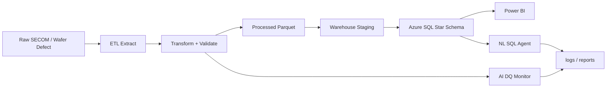

# System Architecture

## Overview

The platform implements a batch-oriented, AI-assisted analytics architecture:

1. **Ingest** raw semiconductor sensor datasets into `data/raw/`.
2. **Transform** with PySpark (local or Databricks) into cleaned Parquet in `data/processed/`.
3. **Model** dimensional extracts into `data/warehouse/` and load Azure SQL star schema.
4. **Monitor** quality with profiling + LLM summaries (`ai/`).
5. **Serve** KPIs via Power BI and optional natural-language SQL.

## Logical Components

```text
┌─────────────┐     ┌──────────────────────┐     ┌─────────────────┐
│ Raw sources │────▶│ PySpark ETL (Spark / │────▶│ Parquet layers  │
│ SECOM, etc. │     │ Databricks)          │     │ processed/WH    │
└─────────────┘     └──────────┬───────────┘     └────────┬────────┘
                               │                          │
                               ▼                          ▼
                    ┌──────────────────────┐     ┌─────────────────┐
                    │ AI modules           │     │ Azure SQL DW    │
                    │ (LangChain + LLMs)   │     │ 6-table star    │
                    └──────────┬───────────┘     └────────┬────────┘
                               │                          │
                               ▼                          ▼
                    ┌──────────────────────┐     ┌─────────────────┐
                    │ Docs / DQ reports    │     │ Power BI        │
                    │ NL SQL answers       │     │ dashboards      │
                    └──────────────────────┘     └─────────────────┘
```

## Data Flow (Mermaid)



## Star Schema (target)

| Type | Table |
| --- | --- |
| Dimension | `dim_date` |
| Dimension | `dim_equipment` |
| Dimension | `dim_process_step` |
| Dimension | `dim_sensor` |
| Dimension | `dim_wafer_lot` |
| Fact | `fact_sensor_readings` |

## Cross-Cutting Concerns

| Concern | Approach |
| --- | --- |
| Configuration | `config/config.yaml` + `.env` |
| Secrets | Environment variables; never commit `.env` |
| Observability | Structured logs under `logs/` |
| Testing | `pytest` under `tests/` |
| AI safety | Human review of generated SQL/code; least-privilege DB roles |

## Future Enhancements

- Orchestration with Azure Data Factory / Databricks Jobs
- Incremental loads and slowly changing dimensions
- Streaming ingest for near-real-time equipment health
